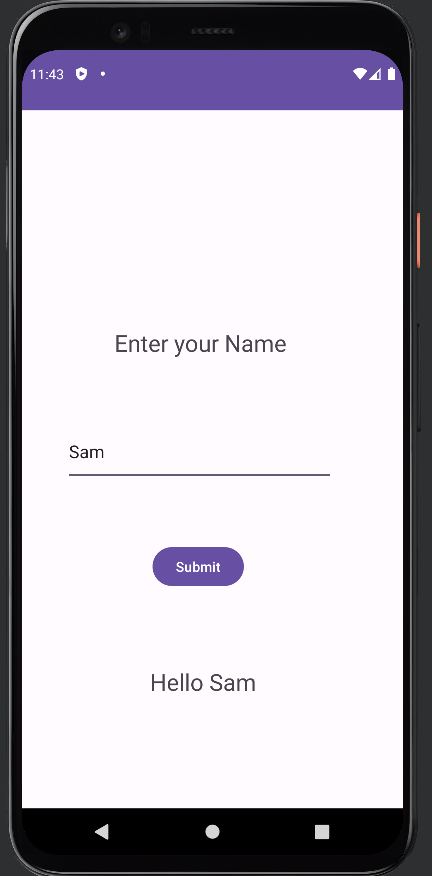

# Week-4: Hello `Name`

Takes `Name` as input and prints `String.format("Hello "+inputName)` as output.

> XML code
```xml
<?xml version="1.0" encoding="utf-8"?>
<androidx.constraintlayout.widget.ConstraintLayout xmlns:android="http://schemas.android.com/apk/res/android"
    xmlns:app="http://schemas.android.com/apk/res-auto"
    xmlns:tools="http://schemas.android.com/tools"
    android:layout_width="match_parent"
    android:layout_height="match_parent"
    android:onClick="greetName"
    tools:context=".MainActivity">

    <TextView
        android:id="@+id/textView"
        android:layout_width="215dp"
        android:layout_height="72dp"
        android:gravity="center"
        android:text="@string/enter_your_name"
        android:textSize="24sp"
        app:layout_constraintBottom_toBottomOf="parent"
        app:layout_constraintEnd_toEndOf="parent"
        app:layout_constraintHorizontal_bias="0.43"
        app:layout_constraintStart_toStartOf="parent"
        app:layout_constraintTop_toTopOf="parent"
        app:layout_constraintVertical_bias="0.314" />

    <EditText
        android:id="@+id/inputName"
        android:layout_width="277dp"
        android:layout_height="63dp"
        android:autofillHints=""
        android:ems="10"
        android:hint="@string/enter_your_name"
        android:inputType="text"
        android:text=""
        app:layout_constraintBottom_toBottomOf="parent"
        app:layout_constraintEnd_toEndOf="@+id/textView"
        app:layout_constraintHorizontal_bias="0.516"
        app:layout_constraintStart_toStartOf="@+id/textView"
        app:layout_constraintTop_toBottomOf="@+id/textView"
        app:layout_constraintVertical_bias="0.118" />

    <Button
        android:id="@+id/submit"
        android:layout_width="wrap_content"
        android:layout_height="wrap_content"
        android:layout_marginTop="52dp"
        android:text="@string/submit"
        app:layout_constraintBottom_toBottomOf="parent"
        app:layout_constraintEnd_toEndOf="@+id/inputName"
        app:layout_constraintHorizontal_bias="0.494"
        app:layout_constraintStart_toStartOf="@+id/inputName"
        app:layout_constraintTop_toBottomOf="@+id/inputName"
        app:layout_constraintVertical_bias="0.045" />

    <TextView
        android:id="@+id/outputTextView"
        android:layout_width="255dp"
        android:layout_height="37dp"
        android:gravity="center"
        android:textSize="24sp"
        app:layout_constraintBottom_toBottomOf="parent"
        app:layout_constraintEnd_toEndOf="@+id/submit"
        app:layout_constraintHorizontal_bias="0.469"
        app:layout_constraintStart_toStartOf="@+id/submit"
        app:layout_constraintTop_toBottomOf="@+id/submit"
        app:layout_constraintVertical_bias="0.405" />

</androidx.constraintlayout.widget.ConstraintLayout>
```

> Java code
```java
package com.example.inputname;

import androidx.appcompat.app.AppCompatActivity;

import android.os.Bundle;
import android.view.View;
import android.widget.Button;
import android.widget.EditText;
import android.widget.TextView;

public class MainActivity extends AppCompatActivity {

    private EditText inputName;
    private TextView outputTextView;

    public void greetName (View view) {
        String yourName = inputName.getText().toString();
        outputTextView.setText(String.format("Hello %s", yourName));
    }

    @Override
    protected void onCreate(Bundle savedInstanceState) {
        super.onCreate(savedInstanceState);
        setContentView(R.layout.activity_main);
        outputTextView = findViewById(R.id.outputTextView);
        inputName = findViewById(R.id.inputName);
        Button button = findViewById(R.id.submit);
        button.setOnClickListener(this::greetName);
    }
}
```

## Output

<div align="center">



</div>
