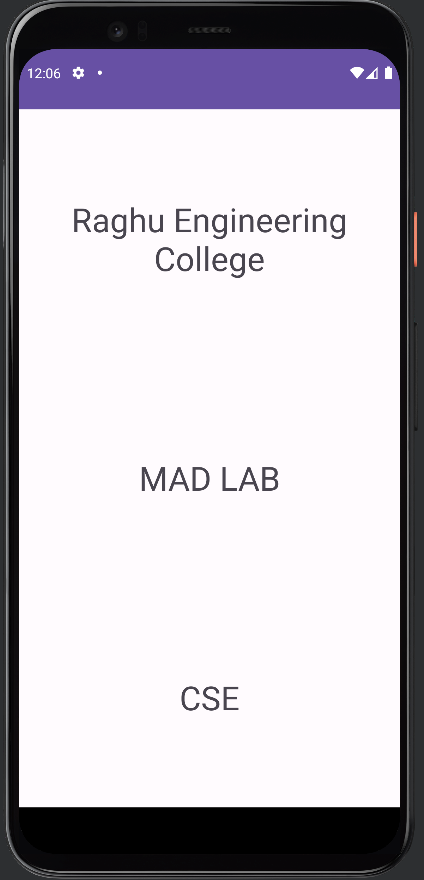

# Week-5: Linear Layout

Sample application which uses Linear Layout for arranging view elements.

> XML code
```xml
<?xml version="1.0" encoding="utf-8"?>
<androidx.constraintlayout.widget.ConstraintLayout xmlns:android="http://schemas.android.com/apk/res/android"
    xmlns:app="http://schemas.android.com/apk/res-auto"
    xmlns:tools="http://schemas.android.com/tools"
    android:layout_width="match_parent"
    android:layout_height="match_parent"
    android:layout_margin="0sp"
    android:layout_marginStart="16sp"
    android:layout_marginTop="16sp"
    tools:context=".MainActivity">

    <LinearLayout
        android:layout_width="match_parent"
        android:layout_height="match_parent"
        android:orientation="vertical"
        app:layout_constraintBottom_toBottomOf="parent"
        app:layout_constraintEnd_toEndOf="parent"
        app:layout_constraintStart_toStartOf="parent"
        app:layout_constraintTop_toTopOf="parent">

        <TextView
            android:id="@+id/textView"
            android:layout_width="match_parent"
            android:layout_height="wrap_content"
            android:layout_weight="1"
            android:gravity="center"
            android:text="@string/raghu_engineering_college"
            android:textSize="34sp" />

        <TextView
            android:id="@+id/textView2"
            android:layout_width="match_parent"
            android:layout_height="wrap_content"
            android:layout_weight="1"
            android:gravity="center"
            android:text="@string/mad_lab"
            android:textSize="34sp" />

        <TextView
            android:id="@+id/textView3"
            android:layout_width="match_parent"
            android:layout_height="wrap_content"
            android:layout_weight="1"
            android:gravity="center"
            android:text="@string/cse"
            android:textSize="34sp" />
    </LinearLayout>
</androidx.constraintlayout.widget.ConstraintLayout>
```

> Java code
```java
package com.example.linearlayout;

import androidx.appcompat.app.AppCompatActivity;

import android.os.Bundle;

public class MainActivity extends AppCompatActivity {

    @Override
    protected void onCreate(Bundle savedInstanceState) {
        super.onCreate(savedInstanceState);
        setContentView(R.layout.activity_main);
    }
}
```

## Output

<div align="center">



</div>
