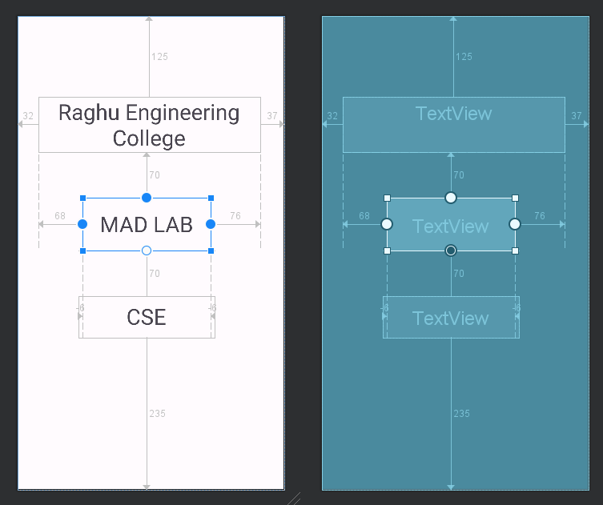
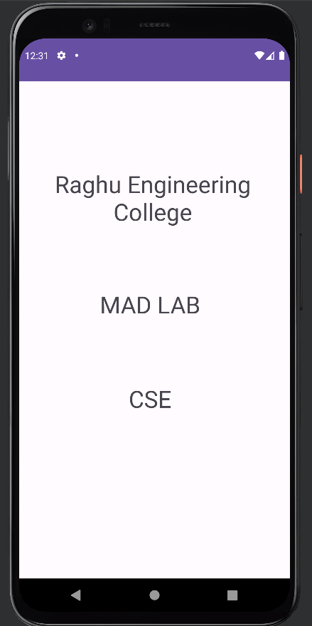

# Week-6: Relative Layout

Sample application which uses Relative Layout for arranging view elements.

> XML code
```xml
<?xml version="1.0" encoding="utf-8"?>
<androidx.constraintlayout.widget.ConstraintLayout xmlns:android="http://schemas.android.com/apk/res/android"
    xmlns:app="http://schemas.android.com/apk/res-auto"
    xmlns:tools="http://schemas.android.com/tools"
    android:layout_width="match_parent"
    android:layout_height="match_parent"
    tools:context=".MainActivity">

    <RelativeLayout
        android:layout_width="match_parent"
        android:layout_height="match_parent"
        tools:layout_editor_absoluteX="16dp"
        tools:layout_editor_absoluteY="-84dp">

        <TextView
            android:id="@+id/textView"
            android:layout_width="342dp"
            android:layout_height="wrap_content"
            android:layout_alignParentStart="true"
            android:layout_alignParentTop="true"
            android:layout_alignParentEnd="true"
            android:layout_marginStart="32dp"
            android:layout_marginTop="125dp"
            android:layout_marginEnd="37dp"
            android:gravity="center"
            android:text="@string/raghu_engineering_college"
            android:textSize="34sp" />

        <TextView
            android:id="@+id/textView2"
            android:layout_width="198dp"
            android:layout_height="82dp"
            android:layout_below="@+id/textView"
            android:layout_alignStart="@+id/textView"
            android:layout_alignEnd="@+id/textView"
            android:layout_marginStart="68dp"
            android:layout_marginTop="70dp"
            android:layout_marginEnd="76dp"
            android:gravity="center"
            android:text="@string/mad_lab"
            android:textSize="34sp" />

        <TextView
            android:id="@+id/textView3"
            android:layout_width="wrap_content"
            android:layout_height="64dp"
            android:layout_below="@+id/textView2"
            android:layout_alignStart="@+id/textView2"
            android:layout_alignEnd="@+id/textView2"
            android:layout_alignParentBottom="true"
            android:layout_marginStart="-6dp"
            android:layout_marginTop="70dp"
            android:layout_marginEnd="-6dp"
            android:layout_marginBottom="235dp"
            android:gravity="center"
            android:text="@string/cse"
            android:textSize="34sp" />
    </RelativeLayout>
</androidx.constraintlayout.widget.ConstraintLayout>
```

> Java code
```java
package com.example.linearlayout;

import androidx.appcompat.app.AppCompatActivity;

import android.os.Bundle;

public class MainActivity extends AppCompatActivity {

    @Override
    protected void onCreate(Bundle savedInstanceState) {
        super.onCreate(savedInstanceState);
        setContentView(R.layout.activity_main);
    }
}
```

## Layout Blue print

<div align="center">



</div>

## Output

<div align="center">



</div>
