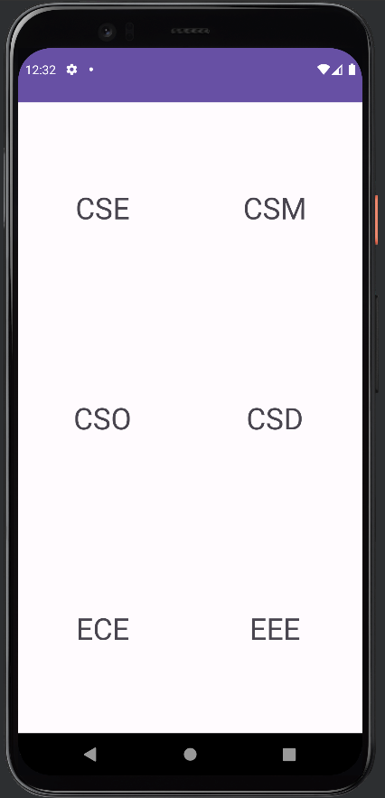

# Week-7: Table Layout

Sample application which uses Table Layout for arranging view elements.

> XML code
```xml
<?xml version="1.0" encoding="utf-8"?>
<androidx.constraintlayout.widget.ConstraintLayout xmlns:android="http://schemas.android.com/apk/res/android"
    xmlns:app="http://schemas.android.com/apk/res-auto"
    xmlns:tools="http://schemas.android.com/tools"
    android:layout_width="match_parent"
    android:layout_height="match_parent"
    tools:context=".MainActivity">

    <TableLayout
        android:layout_width="match_parent"
        android:layout_height="match_parent">

        <TableRow
            android:layout_width="match_parent"
            android:layout_height="match_parent"
            android:layout_weight="1"
            android:gravity="center">

            <TextView
                android:id="@+id/textView1"
                android:layout_width="wrap_content"
                android:layout_height="wrap_content"
                android:layout_weight="1"
                android:gravity="center"
                android:text="@string/cse"
                android:textSize="34sp" />

            <TextView
                android:id="@+id/textView2"
                android:layout_width="wrap_content"
                android:layout_height="wrap_content"
                android:layout_weight="1"
                android:gravity="center"
                android:text="@string/csm"
                android:textSize="34sp" />
        </TableRow>

        <TableRow
            android:layout_width="match_parent"
            android:layout_height="match_parent"
            android:layout_weight="1"
            android:gravity="center">

            <TextView
                android:id="@+id/textView3"
                android:layout_width="wrap_content"
                android:layout_height="wrap_content"
                android:layout_weight="1"
                android:gravity="center"
                android:text="@string/cso"
                android:textSize="34sp" />

            <TextView
                android:id="@+id/textView4"
                android:layout_width="wrap_content"
                android:layout_height="wrap_content"
                android:layout_weight="1"
                android:gravity="center"
                android:text="@string/csd"
                android:textSize="34sp"
                tools:ignore="HardcodedText" />
        </TableRow>

        <TableRow
            android:layout_width="match_parent"
            android:layout_height="match_parent"
            android:layout_weight="1"
            android:gravity="center">

            <TextView
                android:id="@+id/textView5"
                android:layout_width="wrap_content"
                android:layout_height="wrap_content"
                android:layout_weight="1"
                android:gravity="center"
                android:text="@string/ece"
                android:textSize="34sp" />

            <TextView
                android:id="@+id/textView6"
                android:layout_width="wrap_content"
                android:layout_height="wrap_content"
                android:layout_weight="1"
                android:gravity="center"
                android:text="@string/eee"
                android:textSize="34sp" />
        </TableRow>

    </TableLayout>
</androidx.constraintlayout.widget.ConstraintLayout>
```

> Java code
```java
package com.example.linearlayout;

import androidx.appcompat.app.AppCompatActivity;

import android.os.Bundle;

public class MainActivity extends AppCompatActivity {

    @Override
    protected void onCreate(Bundle savedInstanceState) {
        super.onCreate(savedInstanceState);
        setContentView(R.layout.activity_main);
    }
}
```

## Output

<div align="center">



</div>
