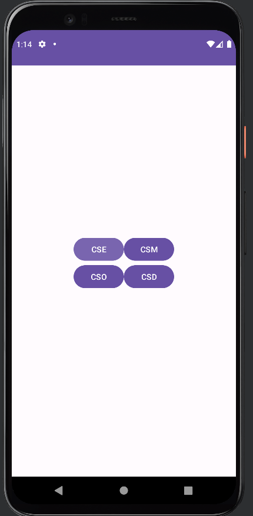

# Week-8: Grid Layout

Sample application which uses Grid Layout for arranging view elements.

> XML code
```xml
<?xml version="1.0" encoding="utf-8"?>
<androidx.constraintlayout.widget.ConstraintLayout
    xmlns:android="http://schemas.android.com/apk/res/android"
    xmlns:app="http://schemas.android.com/apk/res-auto"
    xmlns:tools="http://schemas.android.com/tools"
    android:layout_width="match_parent"
    android:layout_height="match_parent"
    tools:context=".MainActivity">

    <androidx.gridlayout.widget.GridLayout
        android:layout_width="wrap_content"
        android:layout_height="wrap_content"
        app:layout_constraintBottom_toBottomOf="parent"
        app:layout_constraintEnd_toEndOf="parent"
        app:layout_constraintStart_toStartOf="parent"
        app:layout_constraintTop_toTopOf="parent"
        app:layout_constraintVertical_bias="0.477">

        <Button
            android:layout_gravity="fill"
            android:text="@string/cse"
            app:layout_column="0"
            app:layout_row="0" />

        <Button
            android:layout_gravity="fill"
            android:text="@string/csm"
            app:layout_column="1"
            app:layout_row="0" />

        <Button
            android:layout_gravity="fill"
            android:text="@string/cso"
            app:layout_column="0"
            app:layout_row="1" />

        <Button
            android:layout_gravity="fill"
            android:text="@string/csd"
            app:layout_column="1"
            app:layout_row="1" />

    </androidx.gridlayout.widget.GridLayout>
</androidx.constraintlayout.widget.ConstraintLayout>

```

> Java code
```java
package com.example.linearlayout;

import androidx.appcompat.app.AppCompatActivity;

import android.os.Bundle;

public class MainActivity extends AppCompatActivity {

    @Override
    protected void onCreate(Bundle savedInstanceState) {
        super.onCreate(savedInstanceState);
        setContentView(R.layout.activity_main);
    }
}
```

## Output

<div align="center">



</div>
