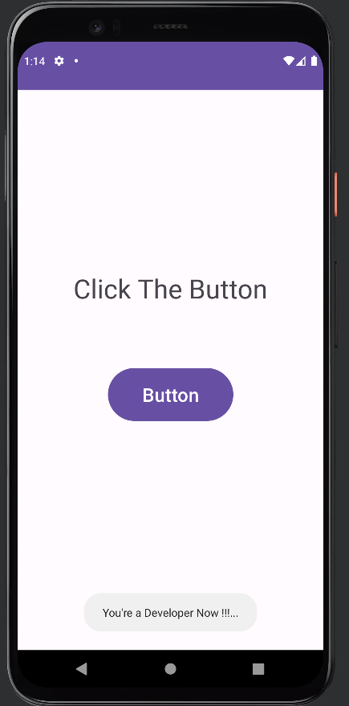

# Week-9: Toast Program

A simple program demonstrating the usage of `Toast` widget.

> XML code
```xml
<?xml version="1.0" encoding="utf-8"?>
<androidx.constraintlayout.widget.ConstraintLayout xmlns:android="http://schemas.android.com/apk/res/android"
    xmlns:app="http://schemas.android.com/apk/res-auto"
    xmlns:tools="http://schemas.android.com/tools"
    android:layout_width="match_parent"
    android:layout_height="match_parent"
    tools:context=".MainActivity">

    <TextView
        android:id="@+id/textView"
        android:layout_width="259dp"
        android:layout_height="61dp"
        android:gravity="center"
        android:text="@string/click_the_button"
        android:textSize="34sp"
        app:layout_constraintBottom_toBottomOf="parent"
        app:layout_constraintEnd_toEndOf="parent"
        app:layout_constraintStart_toStartOf="parent"
        app:layout_constraintTop_toTopOf="parent"
        app:layout_constraintVertical_bias="0.34" />

    <Button
        android:id="@+id/button"
        android:layout_width="161dp"
        android:layout_height="76dp"
        android:layout_marginTop="68dp"
        android:onClick="runToast"
        android:text="@string/button"
        android:textSize="24sp"
        app:layout_constraintEnd_toEndOf="@+id/textView"
        app:layout_constraintStart_toStartOf="@+id/textView"
        app:layout_constraintTop_toBottomOf="@+id/textView" />
</androidx.constraintlayout.widget.ConstraintLayout>
```

> Java code
```java
package com.example.toastprogram;

import androidx.appcompat.app.AppCompatActivity;

import android.os.Bundle;
import android.view.View;
import android.widget.Toast;

public class MainActivity extends AppCompatActivity {

    @Override
    protected void onCreate(Bundle savedInstanceState) {
        super.onCreate(savedInstanceState);
        setContentView(R.layout.activity_main);
    }

    public void runToast(View view) {
        Toast.makeText(this, "You're a Developer Now !!!...", Toast.LENGTH_SHORT).show();
    }
}
```

## Output

<div align="center">



</div>
